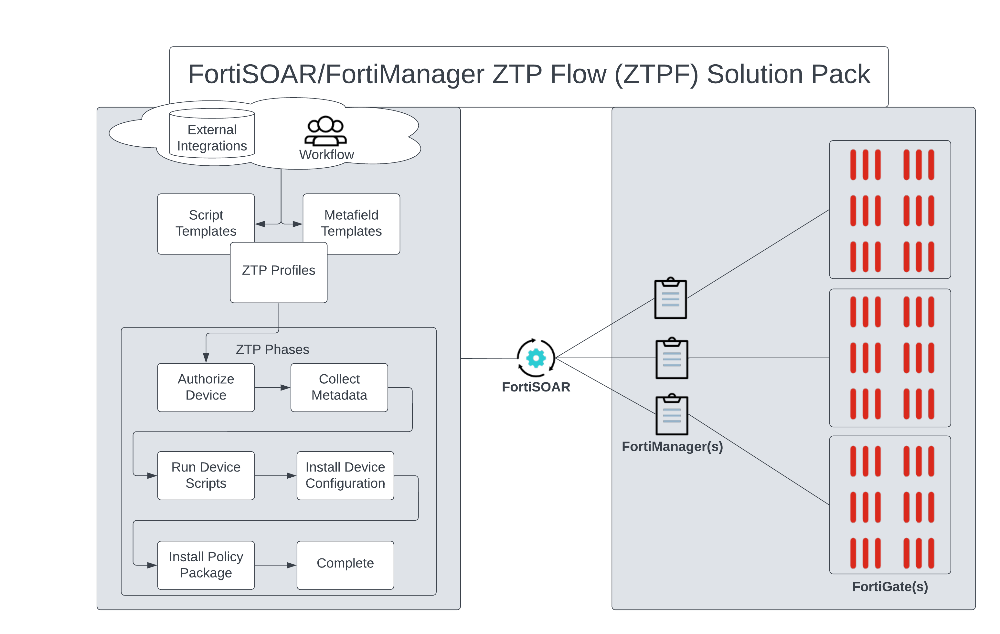

# Release Information

- **Version**: 1.0.0
- **Certified**: No
- **Publisher**: Fortinet CSE
- **Contributor**: James Hilving
- **Compatible Version**: 
  * FortiSOAR v7.4.0 and later
  * FortiManager v7.2.0 and later for full features. Limited features for earlier FortiManager versions. 
<!-- - [Release Notes](./release_notes.md) 
- [Changelog](./docs/changelog.md)-->

# Overview

The NetOps - FortiManager ZTP Solution Pack provides a Zero-Touch Provisioning (ZTP) solution for FortiManager. It includes a FortiManager ZTP Flow (ZTPF) Framework, a NOSOAR (Not Only SOAR) solution designed to streamline provisioning and operational workflows across one or more FortiManager instances. Using FortiSOAR's workflow automation capabilities, the solution simplifies device onboarding, lifecycle management, and offboarding. FortiSOAR integrates with one or more FortiManagers through APIs to collect asset information and automate provisioning tasks. The solution pack also includes sample ZTP Profiles that demonstrate common automation scenarios and serve as templates for building production-ready workflows. You can use FortiManager Device Models generated by the solution pack or existing devices in your environment. These examples can be copied and customized to meet your organization's deployment requirements.

Playbook automation helps streamline a wide range of FortiManager operations, including metadata management, provisioning templates, custom device scripts, policy object templates, and device configuration installations. Workflows can also be extended to integrate with external systems, coordinate with operational teams, or respond automatically to network events. Using the industry-standard [Jinja]( https://jinja.palletsprojects.com/en/3.1.x/) templating languague, administrators can easily create and customize provisioning templates. FortiSOAR can be used as a centralized portal for multiple FortiManagers or operate in the background as an automated solution to ensure your [Fortinet Security Fabric](https://www.fortinet.com/solutions/enterprise-midsize-business/security-fabric) is provisioned and managed according to your organization's requirements. 

# Next Steps

| [Installation](./docs/setup.md#installation) | [Configuration](./docs/setup.md#configuration) | [Usage](./docs/usage.md) | [Contents](./docs/contents.md) |
|----------------------------------------------|------------------------------------------------|--------------------------|--------------------------------|
