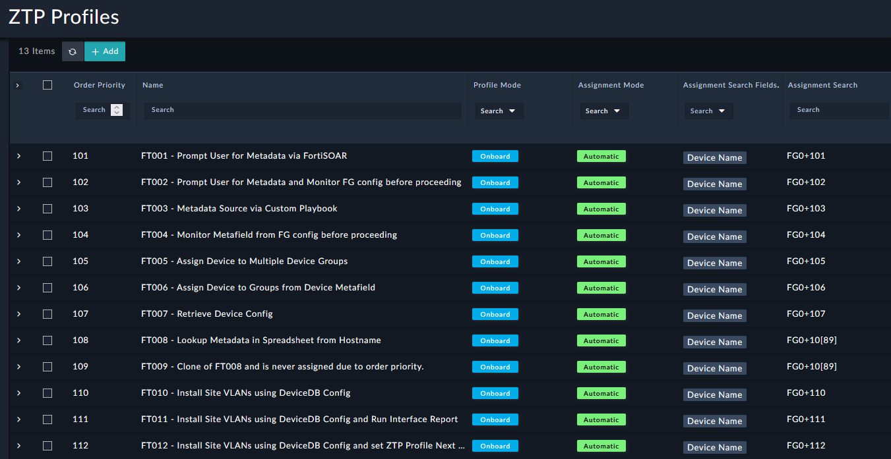
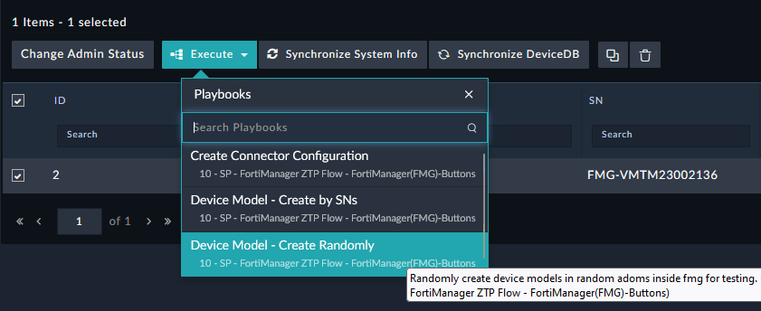
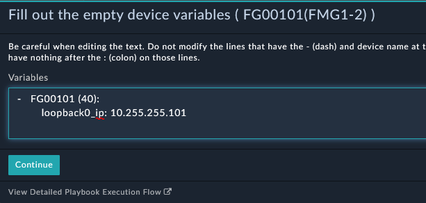
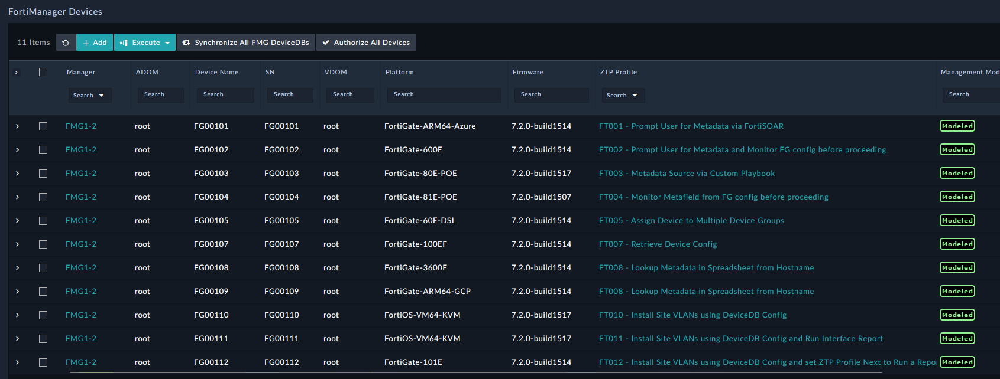
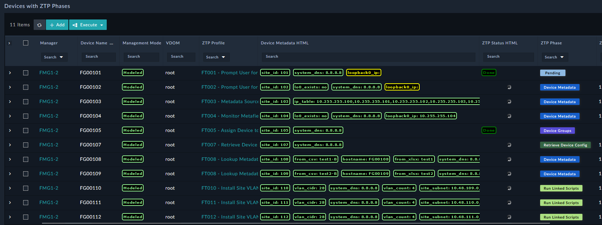
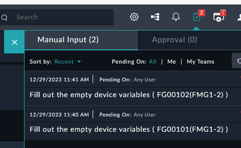
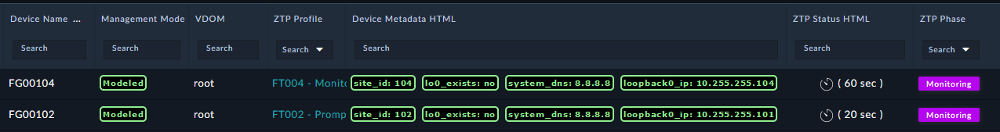
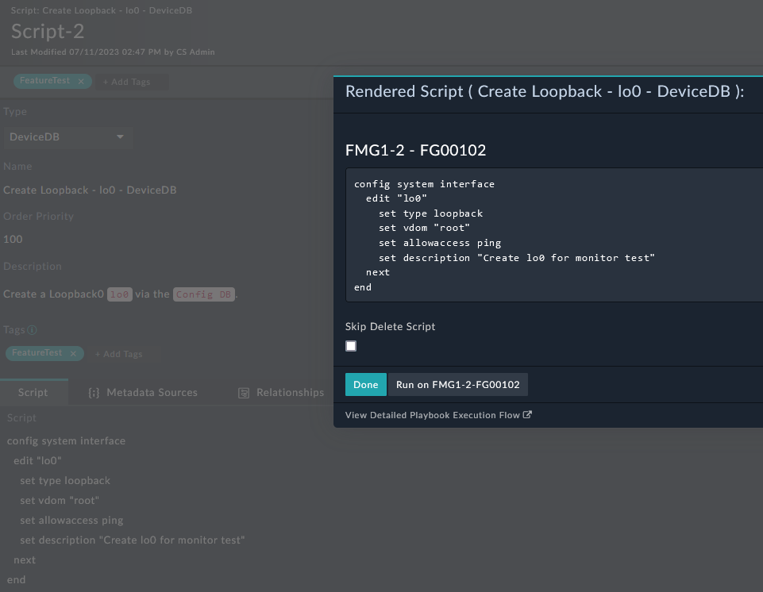
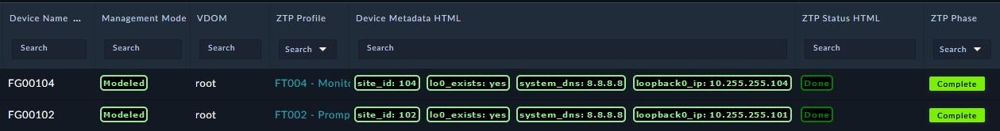

| [Home](../README.md) |
|----------------------|

# Usage

The `NetOps - FortiManager ZTP` solution pack has a variety of uses. This solution pack provides example Zero Touch Provisioning (ZTP) profiles that demonstrate common network automation workflows. These profiles help you evaluate provisioning features and serve as reference implementations for building your own automation solutions. You can use the automatic assignment of these profiles by creating devices that match the criteria defined in a ZTP Profile's `Assignment Search`, or you can manually assign a profile to one or more devices to test a specific workflow or feature.



## Module Overview

### [Managers](./usage/managers.md)>
Use the **Managers** module to define the FortiManager instances managed by the solution. Creating a manager record automatically creates a FortiManager JSON-RPC connector configuration required for API communication. The module also tracks the current firmware version and operational status of each FortiManager.

### [Devices](./usage/devices.md)>
The **Devices** module synchronizes device information from FortiManager and stores it in FortiSOAR. Device records can then be used to drive automation workflows based on device attributes and operational requirements. 
To preserve historical information, device records remain in FortiSOAR even after the corresponding device has been removed from or moved within FortiManager. 

### [Metafield Templates](./usage/metafield_templates.md)>
Use **Metafield Templates** to collect required deployment information before provisioning devices. Templates prompt users for values that are required but not yet available.
Metafield templates can also integrate with external systems to retrieve deployment data dynamically through [Metafield Sources](./usage/jinja_rendering_with_metafield_sources.md). This allows metadata to be generated automatically based on complex business or network requirements.
Metadata stored in FortiSOAR can be exported to FortiManager, allowing existing provisioning workflows to reuse the collected information with minimal configuration changes.

### [Script Templates](./usage/script_templates.md)>
Use **Script Templates** to generate customized FortiManager CLI, Device DB, Policy DB, or TCL scripts for individual devices. 
Scripts in FortiSOAR can also be used to create and maintain FortiManager Provisioning CLI Templates, used for cases such as automate template creation when new ADOMs are deployed. Device reporting scripts can also be used to create a custom device reports and dashboards with user defined content. Scripts can also be enhanced by gathering external data using [Metafield Sources](./usage/jinja_rendering_with_metafield_sources.md).

### [ZTP Profiles](./usage/ztp_profiles.md)>
The **ZTP Profiles** module defines the provisioning workflow for managed devices.
When a new device appears in the FortiManager Device DB—whether unauthorized or already modeled—a ZTP profile can apply the appropriate device templates and provisioning tasks. Progress is tracked and reported for each device throughout the provisioning process.
ZTP Profiles can be assigned on demand or configured to be assigned automatically when new devices are created in FortiManager, regardless of how the devices were added. Automatic profile assignment leverage [Metafield Sources](./usage/jinja_rendering_with_metafield_sources.md) to build sophisticated assignment rules based on device metadata or external information.

## Setup FMG for Feature Tests

To create sample devices in FortiManager for testing:
1. In FortiSOAR, from the left navigation, click **FortiManager** > **Managers**.
2. Select a FortiManager record and click **Execute** > **Device Model - Create Randomly**. 
 
3. When prompted for `Range of Devices` enter `101-118` and click **Continue**. 
 

After the devices are created in FortiManager, the matching ZTP profiles are assigned automatically and the provisioning workflow begins. 


Monitor the provisioning progress in FortiSOAR by clicking **FortiManager > Devices** in the left navigation viewing the status in the ZTP phases column. 


The `FortiManager ZTP Profile and Phase for Devices` dashboard also displays the current ZTP phase for each device.

## ZTP Profile Details

### User Input via FortiSOAR

The **FT001** and **FT002** profiles prompt FortiSOAR users to provide required metafield values before provisioning continues.




### Monitoring FortiGate (FG) Configuration using the FortiManager API

The **FT002** and **FT004** profiles monitor the device configuration until the `lo0` loopback interface is detected.


The `lo0` loopback interface is searched using the following Jinja Template query, which searches the results of `/pm/config/device/{{record.devname}}/global/system/interface`:

```



  



{{md}}
```

You can customize the template to implement any validation logic required by your provisioning workflow:

```
config system interface
  edit "lo0"
    set type loopback
    set vdom "root"
    set allowaccess ping
    set description "Create lo0 for monitor test"
  next
end
```

You can use FortiSOAR to run scripts arbitrarily. In FortiSOAR's left-navigation, click **FortiManager** > **Scripts**, open the **Create Loopback - lo0 - DeviceDB** script record and run the **Render Script with a Device** automation. The automation renders the device-specific CLI, which you can execute through the FortiManager API to create the Loopback. To retain the generated script in FortiManager for review, enable **Skip Delete Script** before running the automation.



After the loopback interface has been created, the monitoring phase completes and the ZTP profile proceeds to the next provisioning stage.


## Additional Examples

- [Multiple ZTP Profile Example](./usage/example1.md): Demonstrates how to provision four unauthorized FortiGate virtual machines in FortiManager by assigning a ZTP profile.
- [Jinja Rendering with Metafield Sources](./usage/jinja_rendering_with_metafield_sources.md): Explains how to use dynamic metafield sources to retrieve external data and enhance device provisioning workflows.

| [Installation](./setup.md#installation) | [Configuration](./setup.md#configuration) | [Contents](./contents.md) |
|-----------------------------------------|-------------------------------------------|---------------------------|
