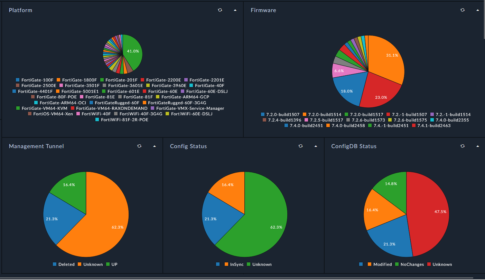
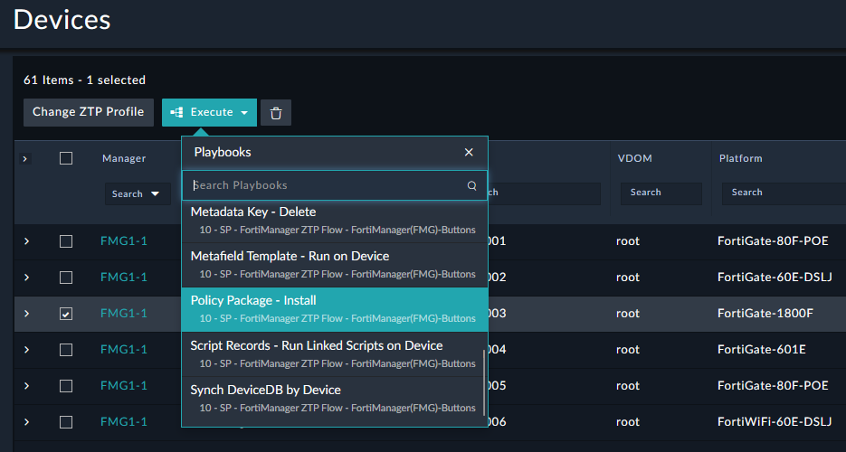
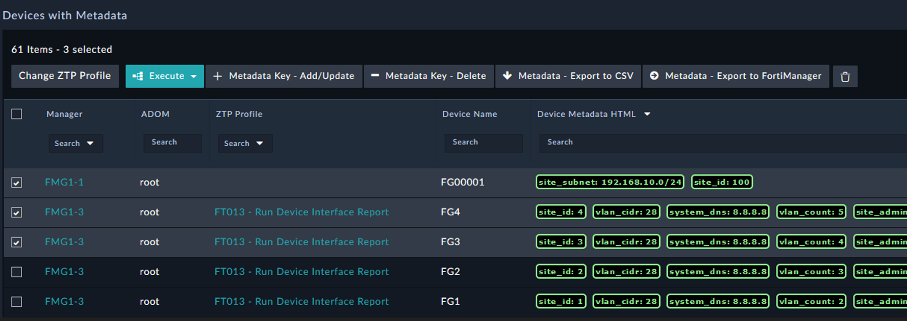

| [Home](../../README.md) / [Usage](../usage.md) |
|------------------------------------------------|

# Devices

## Summary

Device records are created by the FortiManager `Synchronize DeviceDB` action, which synchronizes device information from FortiManager to FortiSOAR. The synchronized data is stored in FortiSOAR and made available for automation, reporting, and device management.

## Actions

The **Devices** module provides a wide range of actions for updating device records, preparing devices for automation, and initiating FortiManager API operations for common management tasks.

Many of these actions are also available from device-focused dashboards, such as the **Device Metadata Manager**, providing convenient access to common device management workflows.

