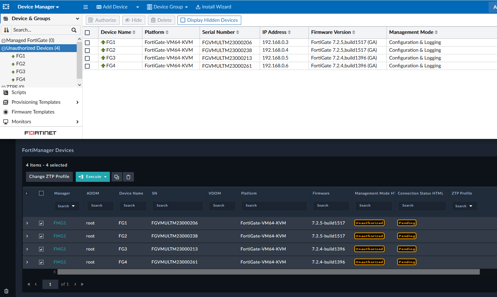
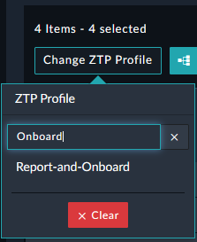
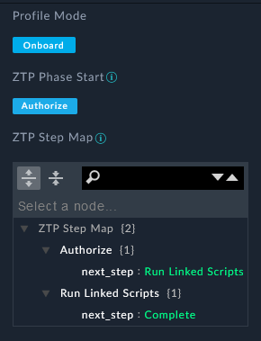
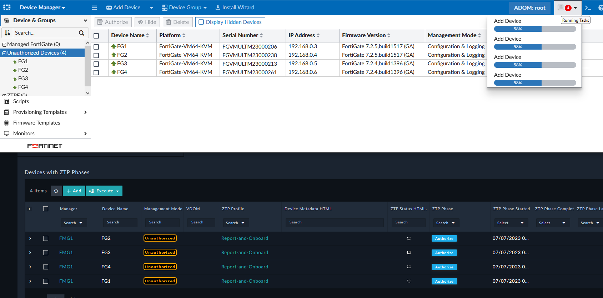
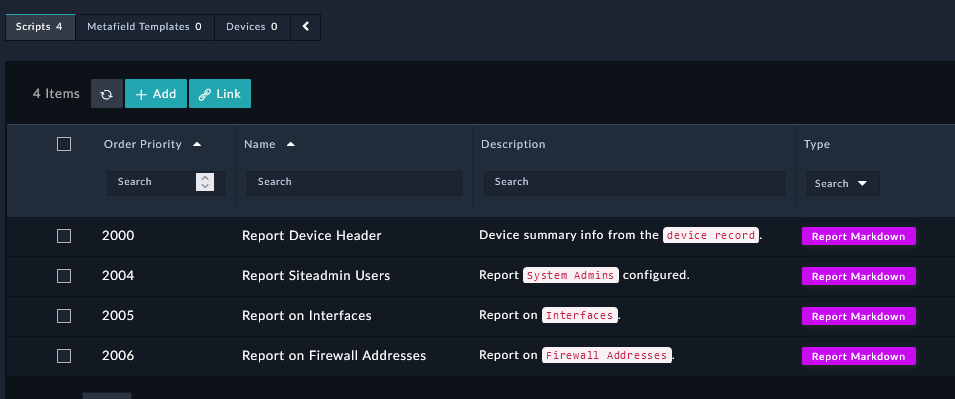
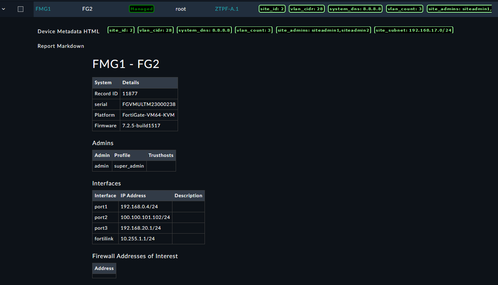
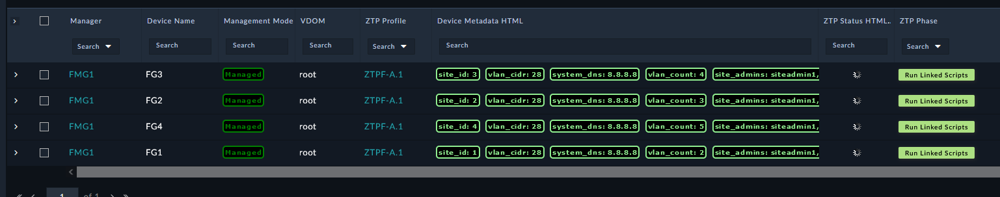
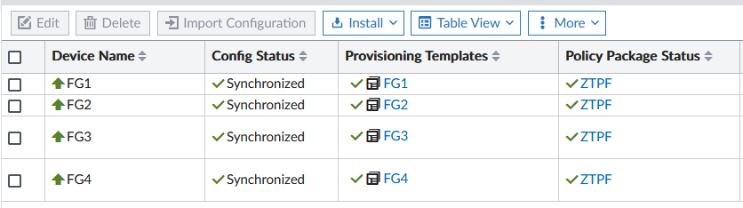
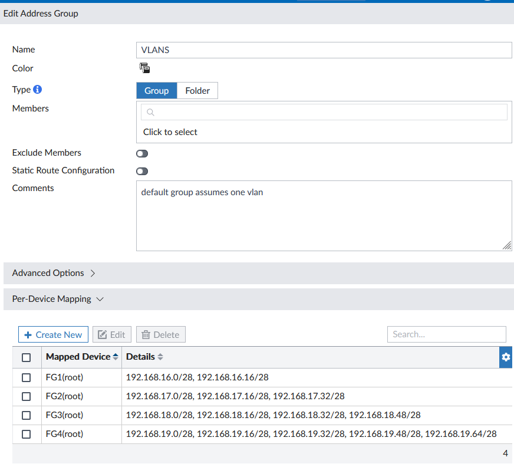
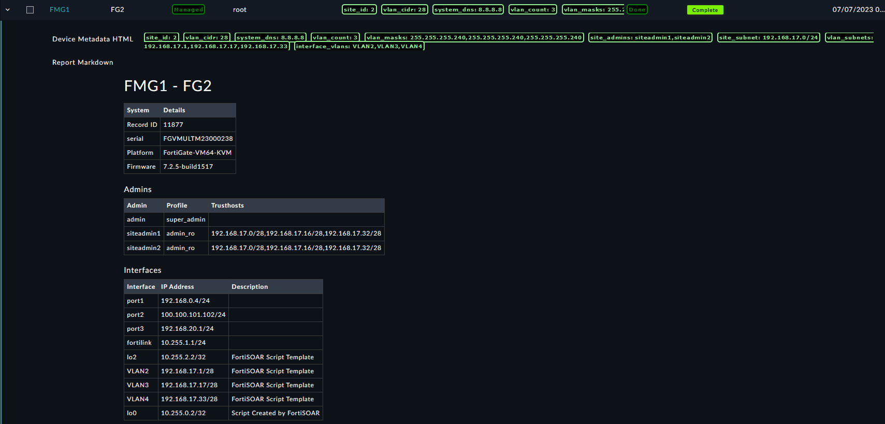

| [Home](../../README.md) / [Usage](../usage.md) |
|------------------------------------------------|

# Provisioning Example Flow

This example demonstrates how to provision four unauthorized FortiGate devices managed by FortiManager. The workflow begins with a single manual action: assigning the initial ZTP profile to the selected devices. To fully automate the workflow, configure the initial ZTP profile to use `auto assign mode`. 

 1. Authorize the FortiGate devices for management in FortiManager.
 2. Create a pre-provisioning device report.
 3. Create local administrator accounts with the `admin_ro` profile.
 4. Create VLAN interfaces using the `site_subnet`, `vlan_count`, and `vlan_cidr` variables defined for each site.
 5. Append all newly created VLAN Subnets to the site admins using the `admin_ro` profile. 
 6. Assign each site to the to the appropriate FortiManager `Device Groups`, `Provisioning Template Groups`, and `Policy Package`.
 7. Update the `VLANS address group` using `Per-Device Mapping` so the FortiManager `Policy Package` references the site-specific VLAN address objects.
 8. Push all the configurations to the sites using the `Install Device Config` and `Install Policy Package` features in FortiManager. 

## Unauthorized Devices
FortiManager synchronizes unauthorized devices with FortiSOAR, where they are processed by the provisioning workflow.

## Assign ZTP Profile
Select the unauthorized devices and assign the `Report-and-Onboard ZTP` profile.

The ZTP profile defines the workflow phases through its `ZTP Step Map` settings.

## Authorize Devices
Assigning the ZTP profile starts the **Authorize** phase, which authorizes the selected devices for management in FortiManager. FortiSOAR performs the authorization by using the FortiManager API.

## ZTP Profile for Onboard & Reporting

The `Report-and-Onboard ZTP` profile also executes report templates during the onboarding process.

As each report script completes, FortiSOAR generates a device report as shown in the following image:

## ZTP Profile for Provisioning

A ZTP profile such as the `Report-and-Onboard ZTP` profile, can automatically assign another profile by configuring the `ZTP Profile Next` setting. This allows the provisioning workflow to progress through multiple phases without additional user intervention.

After the next profile is assigned, additional provisioning phases begin. As shown in the following image, the `ZTPF-A.1` profile populates device metadata required for the remaining provisioning tasks:

## Verify the FortiManager configuration

When provisioning is complete, the devices are authorized and display a healthy status in FortiManager.

The FortiManager Address Object is updated with the VLAN subnets created for each site. 

## Complete the ZTP workflow

This example uses four ZTP profiles to fully provision each site. Each profile performs a specific set of provisioning tasks and can be assigned independently. You can reassign any profile to an existing site to rerun its associated tasks whenever required.

After provisioning completes, verify the deployment by generating a post-provisioning report. Assign the `Device-Post-Report` ZTP profile at any time to collect the current device configuration and confirm that provisioning completed successfully.

