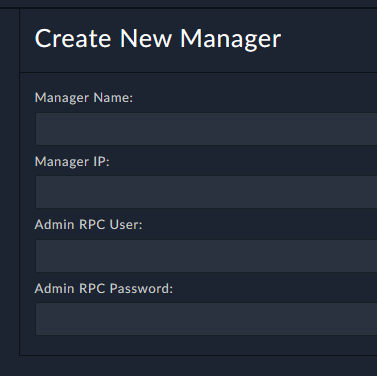
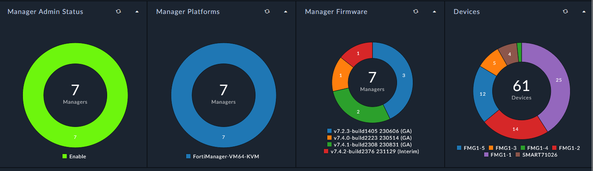
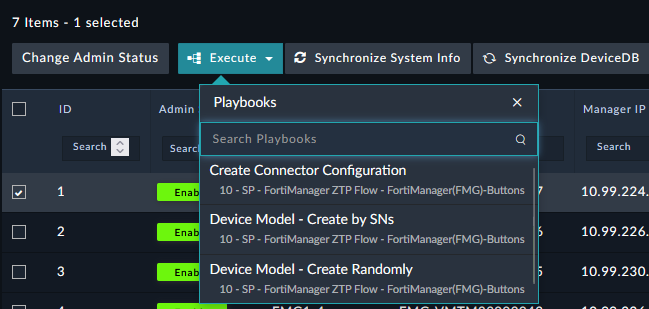

| [Home](../../README.md) / [Usage](../usage.md) |
|------------------------------------------------|

# Managers

Creating a manager record requires only the information needed to establish communication with FortiManager. Specify the `FortiManager Host`, `RPC User` and `RPC Password` to configure the connection.

## Summary

After the manager record is created, FortiSOAR retrieves additional information from FortiManager through the API and stores it for use in automation, monitoring, and reporting.

## Actions

Manager records provide a variety of actions for interacting with FortiManager. The following screenshot highlights some of the available actions:

