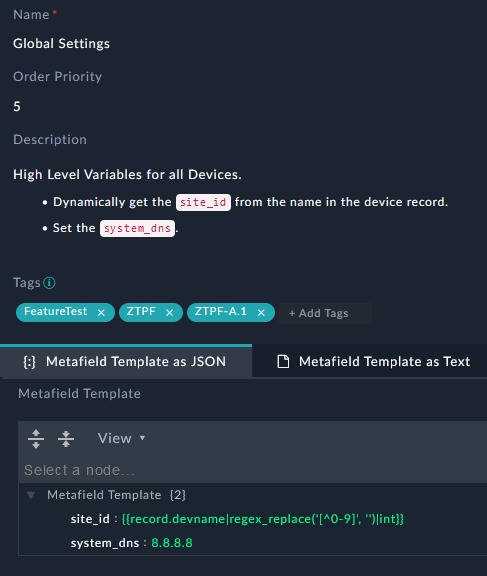
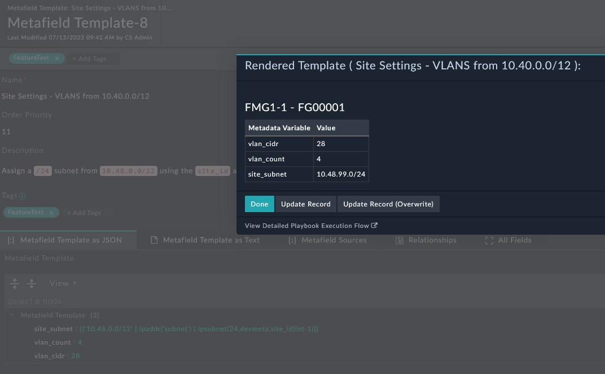

| [Home](../../README.md) / [Usage](../usage.md) |
|------------------------------------------------|

# Metafield Templates
Use metafield templates to generate metadata dynamically by combining Jinja expressions with static values.

## Example Template

The following example creates Global Variables using Jinja and static values:



The following Jinja template generates site-specific metadata:
```
{
  "site_subnet": "{{'10.48.0.0/12' | ipaddr('subnet') | ipsubnet(24,devmeta.site_id|int-1)}}",
  "vlan_count": "4",
  "vlan_cidr": "28"
}
```

Run the **Render Metafield Template with a Device** automation to preview the metadata that will be generated for a selected device, when associated with the site-specific Jinja template. 



After a metafield template has been created, you can use its generated metadata in [Script Templates](./script_templates.md) to dynamically render device-specific configurations. 