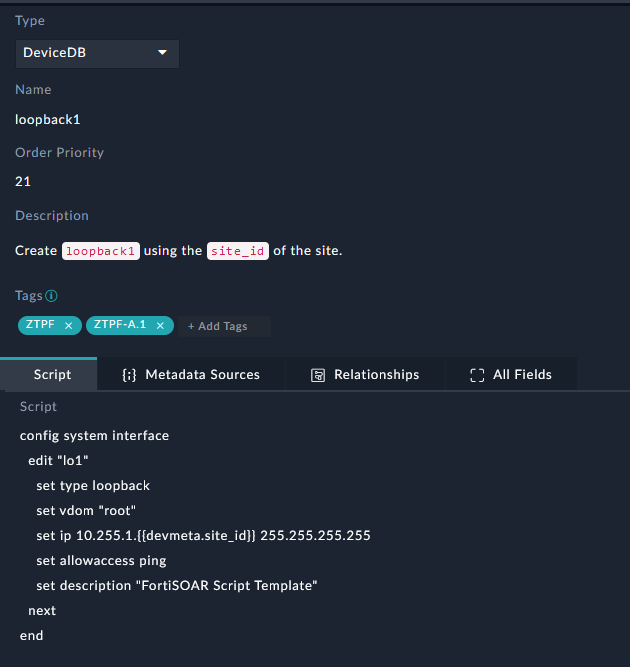
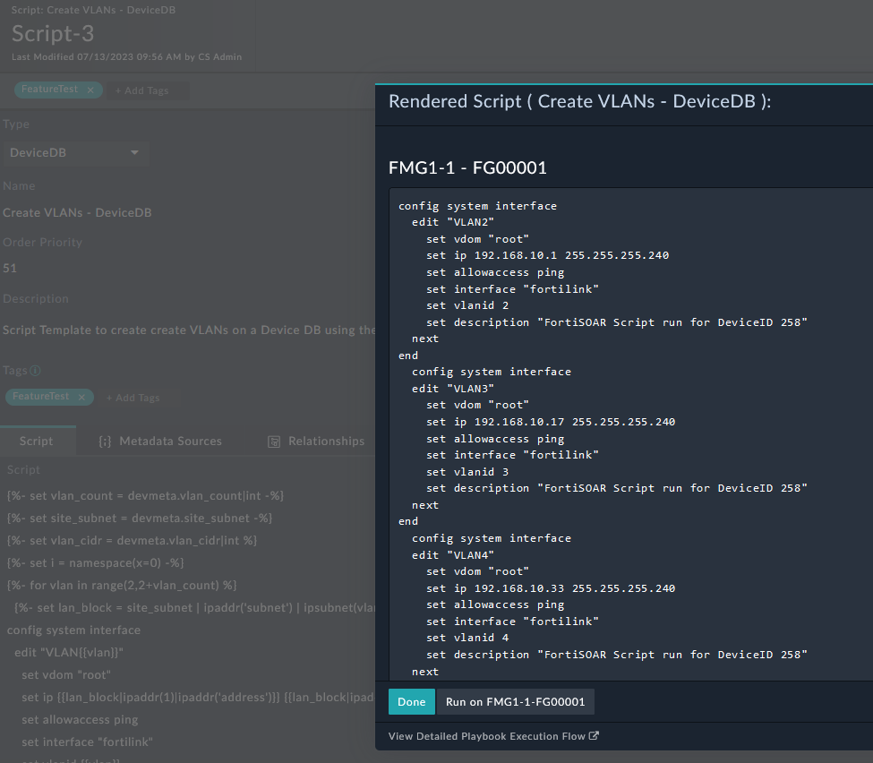

| [Home](../../README.md) / [Usage](../usage.md) |
|------------------------------------------------|

# Script Templates

## Script Types

| Type | Description | 
| ---- | ----------- |
| DeviceDB | Creates a DeviceDB script in FortiManager (FMG) using a Jinja template (from FortiSOAR), runs the script on the device, and deletes the temporary script from FMG after execution. | 
| PolicyDB | Creates a PolicyDB script in FMG using a Jinja template (from FortiSOAR), runs the script on the policy package assigned to the device, and deletes the temporary script from FMG after execution. | 
| Remote CLI | Creates a Remote CLI script in FMG using a Jinja template (from FortiSOAR), runs the script on the device, and deletes the temporary script from FMG after execution. |
| Remote TCL | Creates a Remote TCL script in FMG using a Jinja template (from FortiSOAR), runs the script on the device, and deletes the temporary script from FMG after execution. |
| Provisioning CLI Template | Creates a Provisioning CLI script in FMG using a Jinja template (from FortiSOAR) and associates it with the device by using the device's configured Provisioning Template Group. | 
| Provisioning Jinja Template | Creates a Provisioning Jinja template in FMG  using a Jinja template (from FortiSOAR) and associates it with the device by using the device's configured Provisioning Template Group. FortiSOAR does **not render the Jinja template** because it is intended to be rendered by FMG. |
| Report Markdown | Creates locally hosted report output and appends it to the `Report Markdown` field on the [Device](./devices.md) record.  | 
| [Custom](#custom-script-data) | Custom scripts manage the device record in FortiSOAR and can trigger Metafield Sources that support custom automation workflows. | 

## Example Jinja Rendered CLI Templates

Templates can range from simple configuration blocks to full Jinja templates that generate complex configurations. You can use templates to generate CLI output for the `DeviceDB`, `PolicyDB`, `Remote CLI`, and `Remote TCL` script types. 



For more advanced use cases, script templates can consist of full Jinja scripts that generate complex configurations:

```





  
config system interface
  edit "VLAN{{vlan}}"
    set vdom "root"
    set ip {{lan_block|ipaddr(1)|ipaddr('address')}} {{lan_block|ipaddr('netmask')}}
    set allowaccess ping
    set interface "fortilink"
    set vlanid {{vlan}}
    set description "FortiSOAR Script run for DeviceID {{record.id}}"
  next
end
  

```



## Custom Script Data

Custom scripts must output a JSON that defines the actions to perform on the device record. You can use [Metafield Sources](../usage/jinja_rendering_with_metafield_sources.md) to implement custom logic and extend the actions performed by `Run Link Scripts` during [ZTP Phases](ztp_profiles.md#ztp-phases). 

```


{{idx}}
```